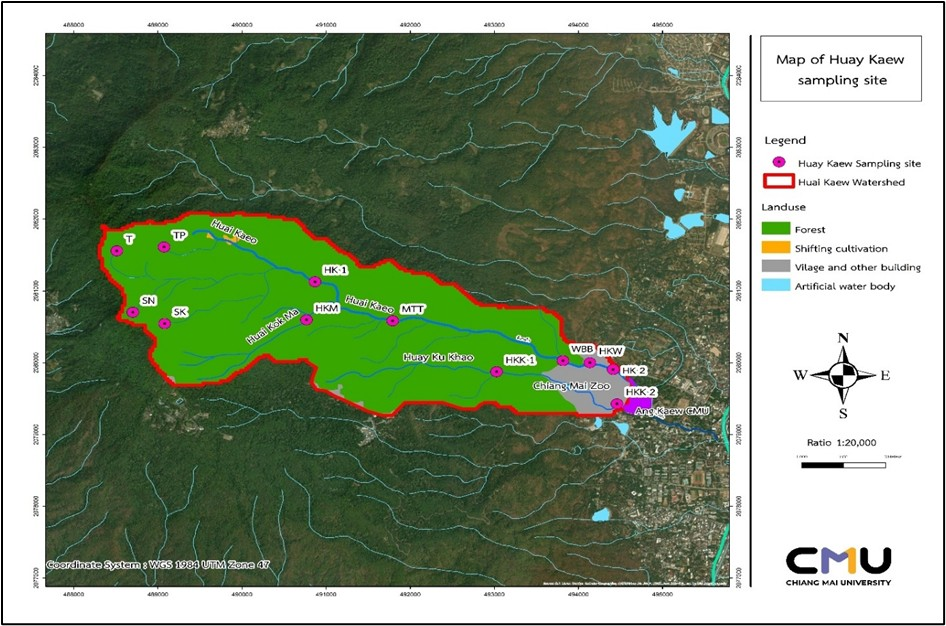

# 🌊 **Statistical Analysis of Water Quality in the Huay Kaew Watershed**

This project provides a **comprehensive statistical analysis and visualization** of water quality data from the Huay Kaew Watershed, Chiang Mai Province, Thailand. Using **advanced statistical techniques**, it evaluates key physico-chemical parameters to gain actionable insights into **sustainable water resource management**.

---

## 🔍 **Key Features**

- **📊 Correlation Analysis**  
  Explores relationships between parameters such as temperature, pH, turbidity, dissolved oxygen, and nutrient concentrations.

- **📈 ANOVA & Welch’s t-test**  
  Identifies significant variations in water quality across multiple locations and time periods.

- **🎨 Data Visualization**  
  Includes bar plots, correlation heatmaps, and grouped mean calculations to effectively summarize trends.

---

## 🛠️ **Tools & Techniques**

- **Programming Language**: Python  
- **Statistical Libraries**: NumPy, Pandas, SciPy, Statsmodels  
- **Visualization Libraries**: Matplotlib, Seaborn  
- **File Format**: Jupyter Notebook (`ES2.ipynb`)

This project demonstrates the **integration of Python-based statistical techniques** with environmental data science to support **evidence-based decision-making** for water resource management.

## Project Notebooks

- [📘 ES2.ipynb](ES2.ipynb): A Jupyter Notebook analyzing statistical data for the project.
